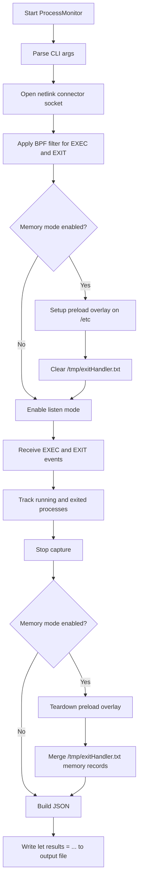
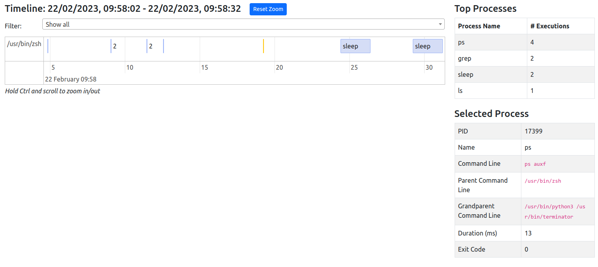

# Linux Process Monitor

Linux Process Monitor records process exec and exit events from the kernel and writes timeline-ready output for visualization and post-analysis.

It is designed for profiling process churn on embedded and service-heavy systems, with optional per-process memory data capture at exit.

## What It Captures

- Process exec and exit events from the kernel proc connector (netlink)
- Start and end timestamps for each observed process
- PID, parent and grandparent command lines (best-effort)
- Grouping and summary stats suitable for timeline and frequency analysis
- Optional memory stats at process exit when memory preload mode is enabled

## How It Works



## Requirements

- Linux system with proc connector support
- Root privileges to listen to proc connector events
- CMake and C++ compiler toolchain
- Kernel support for netlink process events:
	- CONFIG_NET
	- CONFIG_CONNECTOR
	- CONFIG_PROC_EVENTS
	- CONFIG_PROC_FS (for /proc lookups used by command-line and parent/service resolution)
- For memory mode:
	- A valid preload library path passed via --mem
	- /sbin/mount-copybind available
	- Ability to bind-mount /etc

Quick kernel config check (if /proc/config.gz is available):

```sh
zgrep -E 'CONFIG_(NET|CONNECTOR|PROC_EVENTS|PROC_FS)=' /proc/config.gz
```

Expected values are typically =y (built-in) or =m (module), except CONFIG_PROC_EVENTS which is generally built-in on kernels that provide proc connector events.

## Build

```sh
mkdir build
cd build
cmake -DCMAKE_BUILD_TYPE=Release ../
make -j"$(nproc)"
```

## Build And Run With Docker

A minimal multi-stage Dockerfile is included for portable builds.

Build image:

```sh
docker build -t process-monitor:latest .
```

Smoke test (shows CLI help):

```sh
docker run --rm process-monitor:latest --help
```

Run capture (Linux host required):

```sh
docker run --rm \
	--privileged \
	--pid=host \
	-v /tmp/processMonitor:/tmp/processMonitor \
	process-monitor:latest \
	--duration 60 --output /tmp/processMonitor/results.js
```

Run with memory mode:

```sh
docker run --rm \
	--privileged \
	--pid=host \
	-v /tmp/processMonitor:/tmp/processMonitor \
	process-monitor:latest \
	--duration 60 \
	--output /tmp/processMonitor/results.js \
	--mem /usr/local/lib/libexithandler.so
```

Notes:

- Building the image works from macOS.
- Functional process-event capture depends on Linux kernel features and should be run on a Linux host/device.
- The `--privileged` and `--pid=host` flags are required for this monitor's kernel event and mount-related behavior.

## Run

### Basic capture

```sh
./ProcessMonitor --duration 60 --output /tmp/processMonitor/results.js
```

### Capture with memory exit stats

```sh
./ProcessMonitor --duration 60 --output /tmp/processMonitor/results.js --mem /path/to/libexithandler.so
```

## CLI Options

- -h, --help
	- Print help and exit
- -d, --duration <seconds>
	- Capture duration in seconds
	- Default is 30
- -o, --output <file>
	- Output JavaScript file path (required)
- -m, --mem <path>
	- Enable memory capture mode
	- Requires path to preload library (for example libexithandler.so)

## Memory Capture Mode Details

When --mem is used:

- ProcessMonitor creates a copied /etc tree under /media/apps/etc
- It bind-mounts that copy over live /etc using mount-copybind
- It writes the preload library path to /etc/ld.so.preload in the overlay
- The preload library appends process-exit memory records to /tmp/exitHandler.txt
- On stop, ProcessMonitor merges those records into process results

Safety and recovery behaviors implemented in code:

- /tmp/exitHandler.txt is cleared at the start of each memory-enabled capture
- If a stale bind mount is detected from a previous run, recovery unmount is attempted before reuse
- If teardown unmount fails, preload-active state is retained to allow retry and avoid false-clean status
- Overlay /etc/ld.so.preload is cleared before unmounting overlay

Operational note:

- Memory mode temporarily affects system-wide /etc while capture is running, so it should be used with care on live systems.

## Output Format

The output file is JavaScript, not plain JSON. It is written as:

```js
let results = { ... };
```

Top-level keys:

- processes
- groups
- stats
- start
- end

### processes[] fields

- id
	- Composite string: pid_startTimeMs
- pid
- content
	- Stripped process name
- title
	- Stripped command line
- group
	- Derived parent grouping label
- start
	- Epoch milliseconds
- end
	- Epoch milliseconds
- fullCommandLine
- parentCommandLine
- grandparentCommandLine
- exitCode
- systemdService
- Optional fields when memory data is available:
	- pss (KB)
	- swapPss (KB)
	- rss (KB)
	- utime (jiffies)
	- stime (jiffies)

### groups[] fields

- id
- content

### stats

- stats.processes[]
	- process
	- frequency
- stats.services[]
	- serviceName
	- frequency

## Timeline Analysis

Copy generated output to:

- results_gui/results.js

Then open:

- results_gui/index.html



Tips:

- Hold Ctrl and scroll to zoom
- Click a process to inspect details
- Use grouping filters to focus on parent process families
- Zoom in to expand clusters

## Textual Analysis Script

For larger datasets, use:

```sh
python3 ./scripts/results_parser.py /path/to/results.js
```

The script reports:

- Processes by group
- Top systemd services
- Top unique processes

## Notes on Name Normalization

The monitor strips common interpreter prefixes to approximate the true command. Example:

- /bin/sh -c ls -alh becomes ls -alh for display

This improves grouping and frequency stats for shell-driven process trees.
